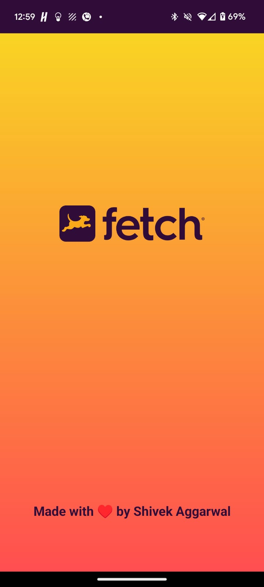
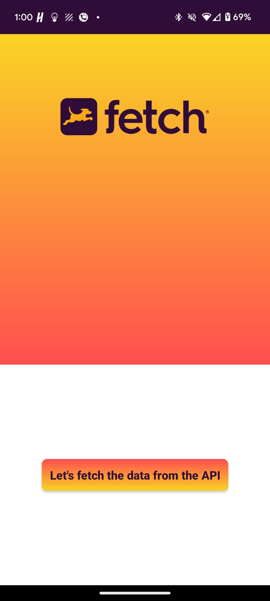
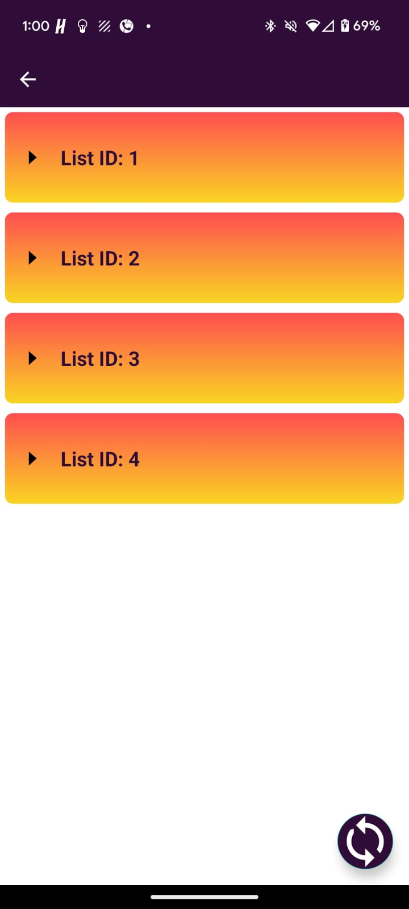
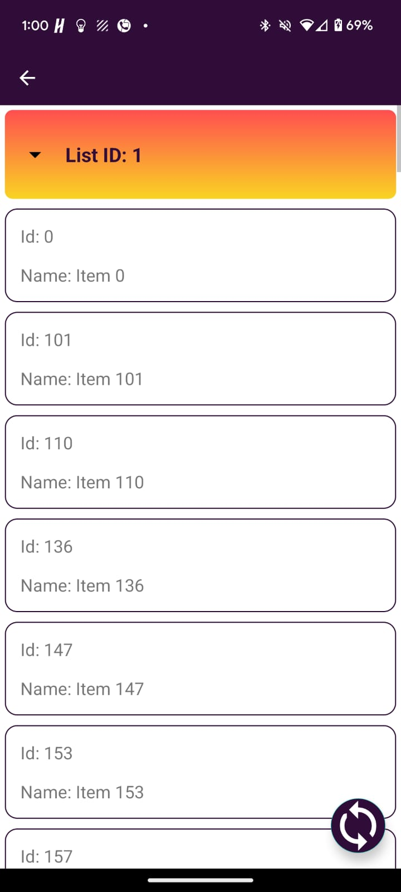
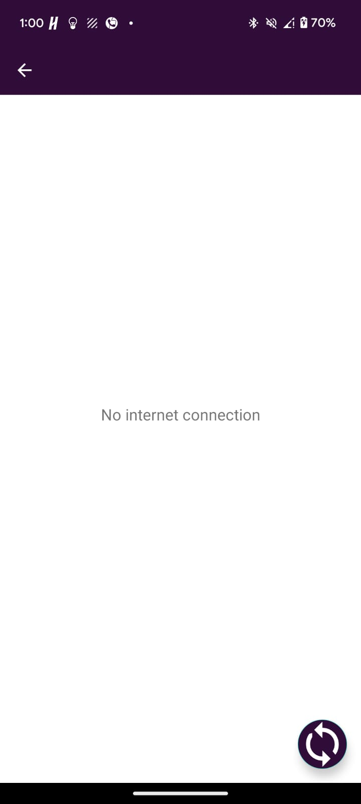

# Fetch Rewards : Android Engineer Exercise
## Fetch Task Application

This is an Android application developed using Kotlin that demonstrates the use of MVVM architecture along with Retrofit for network operations and Coroutines for asynchronous processing. It includes a animated splash screen, a home screen, and a task screen. The task screen displays a list of items grouped by `listId`.The items are displayed sorted by `listId` first and then by `name`. The items can be expanded and collapsed using an arrow icon. The application fetches data from a remote API(https://fetch-hiring.s3.amazonaws.com/hiring.json) and handles loading, error states, and retry mechanisms.

## Features

- Splash screen with animation
- Home screen with navigation to the task screen
- Task screen that displays grouped items
- Fetches data from a remote API using Retrofit
- Uses Coroutines for background operations
- Displays items grouped by `listId` and sorted by `listId` and `name`
- Allows expanding and collapsing of item groups
- Handles loading and error states
- Provides a refresh button to retry fetching data

## Technologies Used

- **Kotlin**: Primary language for app development
- **MVVM Architecture**: For separation of concerns
- **Retrofit**: For network operations
- **Coroutines**: For asynchronous operations

## Screenshots








## Getting Started

These instructions will get you a copy of the project up and running on your local machine for development and testing purposes.

### Prerequisites

- Android Studio
- A device or emulator running Android

### Installation

1. **Clone the repository:**

   ```sh
   git clone https://github.com/yourusername/your-repo-name.git


2. **Open the project in Android Studio:**

Open Android Studio and select Open an existing Android Studio project. Navigate to the directory where you cloned the repository and select it.

3. **Build the project:**

Click on Build > Rebuild Project to build the project.

4. **Run the project:**

Click on Run > Run 'app' to run the application on your device or emulator.

 

